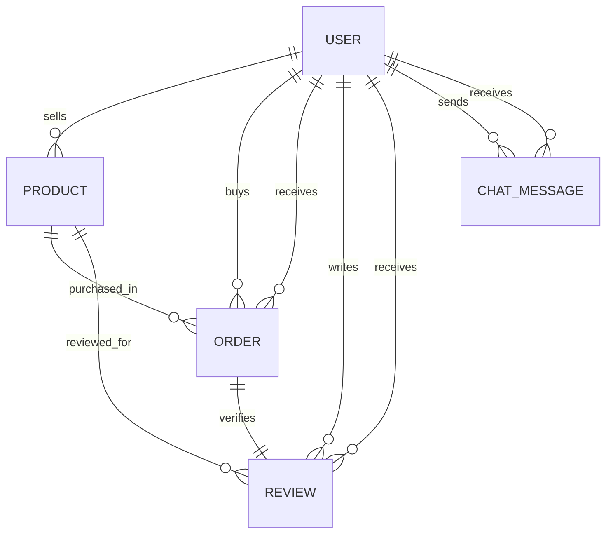

# TrustBazaar Capstone Project Report

## Project Title

TrustBazaar: Verified Buyer Rating, Review, and Real-Time Seller Chat System

## Problem Statement

In online marketplaces, buyers often hesitate to purchase from unknown sellers because seller quality, delivery reliability, and communication are hard to verify. At the same time, fake or unverified reviews can damage trust. TrustBazaar solves this real-world problem by allowing reviews only after a buyer completes a purchase. Each review is linked to an order, product, buyer, and seller, making seller reputation more reliable.

## Objectives

- Build a secure login and registration system using JWT authentication.
- Allow buyers to purchase products from sellers.
- Allow buyers to rate and review sellers only after a completed order.
- Automatically update seller average rating and review count.
- Provide real-time buyer-seller communication using Socket.io.
- Build a professional responsive UI using React, Vite, and Tailwind CSS.
- Make the project deployment-ready for Render and Vercel.

## Main Modules

### Authentication

Users can register as buyers or sellers and log in using email and password. JWT tokens protect private routes such as orders, review posting, and chat history.

### Marketplace

Products are listed with seller information, price, category, stock, and seller rating. Buyers can search, filter, paginate, and purchase products.

### Orders

When a buyer purchases a product, an order is created with buyer, seller, product, order status, total amount, and review status.

### Reviews

Reviews are order-linked. A buyer cannot review a seller without a completed order, and each order can receive only one review. After review creation, the backend recalculates the seller rating average and review count.

### Real-Time Chat

Buyers and sellers can open a private chat room. Socket.io broadcasts new messages instantly and stores chat history in MongoDB.

## Database Collections

### User

Stores buyer and seller accounts, authentication details, profile information, seller rating average, and rating count.

### Product

Stores product details and references the seller user.

### Order

Stores purchase records and references buyer, seller, and product.

### Review

Stores verified feedback and references buyer, seller, product, and order.

### ChatMessage

Stores private buyer-seller messages using a shared room id.

## Relationship Summary

## API Endpoints

| Method | Endpoint | Purpose |
| --- | --- | --- |
| POST | `/api/auth/register` | Create buyer or seller account |
| POST | `/api/auth/login` | Login and receive JWT token |
| GET | `/api/auth/me` | Get logged-in user profile |
| GET | `/api/products` | Paginated product listing with search/filter |
| GET | `/api/products/:id` | Product and seller details |
| POST | `/api/orders` | Create a purchase order |
| GET | `/api/orders/my` | Get logged-in buyer orders |
| POST | `/api/reviews` | Create verified order-based review |
| GET | `/api/reviews/seller/:sellerId` | Get seller reviews |
| GET | `/api/chat/:userId` | Get private chat history |

## Performance Features

- Lazy loaded React pages with `React.lazy`.
- Paginated product listing with load-more behavior.
- Limited review and chat history queries.
- Image lazy loading on product and order cards.
- Vite production build for optimized assets.

## Deployment Plan

### Backend on Render

Use the `server` folder as the Render root directory.

- Build command: `npm install`
- Start command: `npm start`
- Required environment variables: `MONGODB_URI`, `JWT_SECRET`, `CLIENT_URL`, `NODE_ENV`

### Frontend on Vercel

Use the `client` folder as the Vercel root directory.

- Build command: `npm run build`
- Output directory: `dist`
- Required environment variables: `VITE_API_URL`, `VITE_SOCKET_URL`

## Future Scope

- Add seller product management dashboard.
- Add admin moderation for reported reviews.
- Add image uploads using Cloudinary or S3.
- Add payment gateway integration.
- Add unread message counts and read receipts.

